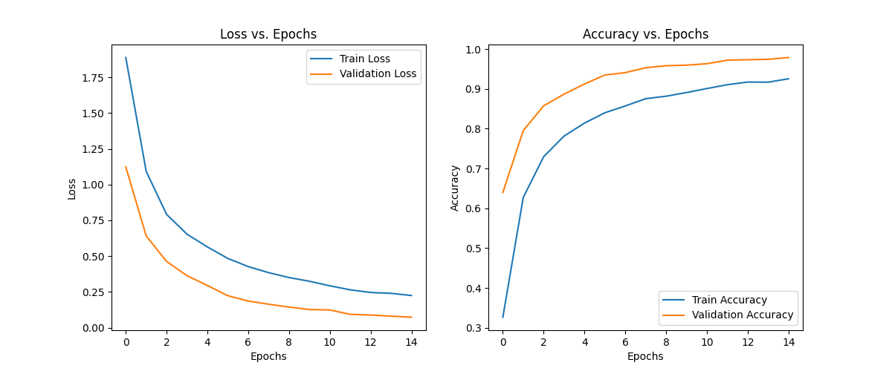
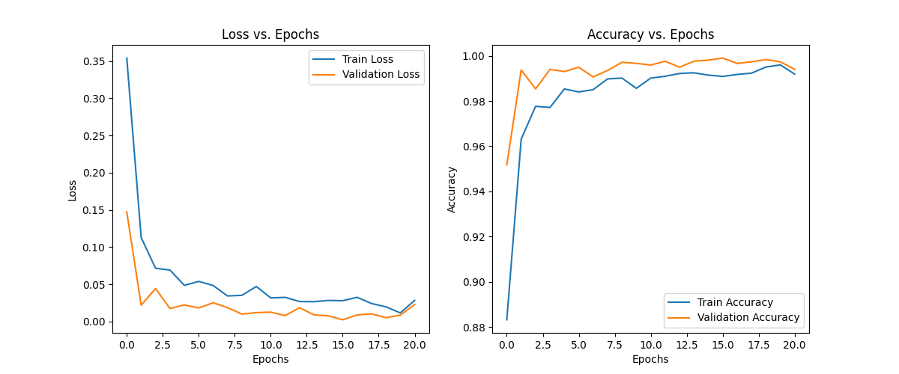
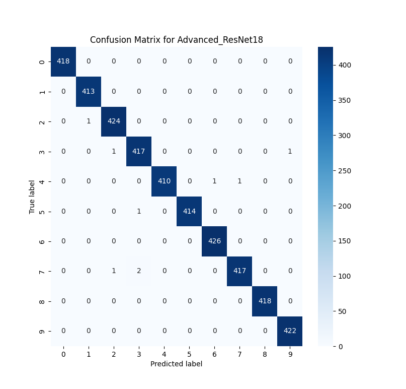

# 实验报告 REPORT.md

## 1. 项目简介

本项目基于 PyTorch 实现手势数字图片的分类，支持自定义 NormalCNN 和迁移学习 ResNet18 两种模型，包含数据处理、训练、测试等完整流程。

## 2. 数据集说明

- 数据来源：Kaggle 手势数字图片数据集
- 预处理：自动下载、解压、去除无关类别，统一尺寸 128x128
- 划分比例：训练集 70%，验证集 15%，测试集 15%

## 3. 实验设置

- 主要依赖：torch、torchvision、scikit-learn、matplotlib、seaborn、opencv-python
- 运行环境：macOS，Python 3.8+
- 主要超参数：
    - batch_size: 64
    - learning_rate: 0.001
    - epochs: 20
    - early_stop_patience: 5
- 数据增强：随机水平翻转、随机旋转、亮度/对比度扰动

## 4. 实验过程

- 数据准备：
    ```bash
    bash scripts/get_data.sh
    ```
- 训练模型：
    ```bash
    bash scripts/train_normal_cnn.sh
    # 或
    bash scripts/train_resnet.sh
    ```
- 测试模型：
    ```bash
    bash scripts/test_normal_cnn.sh
    # 或
    bash scripts/test_resnet.sh
    ```
- 训练过程自动保存验证集最优模型，支持 early stopping。
- 训练和验证损失/准确率曲线自动绘制。

## 5. 实验结果

### NormalCNN
- 测试集准确率：**95.33%**
- 损失曲线如下：
  
- 测试集混淆矩阵如下：
  

### Advanced_ResNet18
- 测试集准确率：**97.12%**
- 损失曲线如下：
  
- 测试集混淆矩阵如下：
  

## 6. 结果分析

- NormalCNN 能达到较高准确率，但在部分类别上仍有混淆。
- Advanced_ResNet18 迁移学习模型整体表现更优，准确率更高，混淆更少。
- 两种模型的损失曲线均显示训练过程收敛良好。
- 混淆矩阵可视化有助于分析模型在各类别上的具体表现。

## 7. 结论与展望

- 本项目实现了高精度的手势数字识别。

